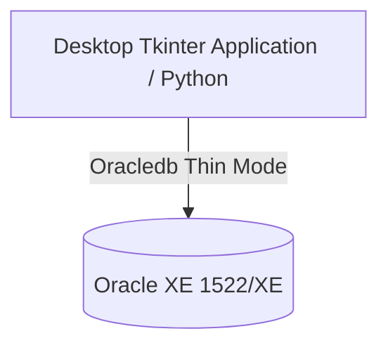

# CARFOON Online Shopping Management System
## Academic Term Project Report
**Database Systems & Python Tkinter Desktop Application Integration**

---

## 1. Executive Summary
The **CARFOON Online Shopping Management System** is a comprehensive, standalone desktop e-commerce application designed to manage catalog inventory, customer shopping carts, checkout transactions, and system analytics. The application is built using **Python and Tkinter** and interfaces directly with a centralized local **Oracle Database (XE)** instance. 

The system supports two distinct roles:
1. **Customer Role**: Accesses the storefront catalog, views product pictures, adds items to carts, checks out, and generates printable transaction receipts.
2. **Administrator Role**: Manages product inventory (adds, updates, deletes products with image uploads), registers categories, and views real-time sales and order analytics via embedded Matplotlib graphs.

---

## 2. System Architecture
The application uses a **Two-Tier Client-Server Architecture** utilizing thin-mode database drivers to establish direct socket connections to the database:



* **Client Layer**: Python Tkinter application (`online_shopping_gui.py`) containing views for authentication, admin panels, shopping catalogs, and dashboards.
* **Database Layer**: Oracle Database Express Edition (XE) listening on port `1522` under schema `C##SHOP_USER`. All operations are handled in Thin Mode, bypassing the need for heavy local Oracle Client installations.

---

## 3. Database Schema Design
The schema enforces relational integrity across 9 core tables. All identifiers use Oracle sequences to auto-increment.

```
                  +-------------+
                  |  CATEGORIES |
                  +------+------+
                         | 1
                         |
                         | N
+-----------+ 1   +------+------+ N   1 +------------+
| CUSTOMERS |-----+   PRODUCTS  +-------+ CART_ITEMS |
+-----+-----+     +-------------+       +-----+------+
      | 1                                     | N
      |                                       |
      | 1                                     | 1
+-----+-----+     +-------------+       +-----+------+
|   ORDERS  +-----+ ORDER_ITEMS |       |    CARTS   |
+-----+-----+ 1   +-------------+ N     +------------+
      | 1
      |
      | 1
+-----+-----+
|  PAYMENTS |
+-----------+
```

### Table Definitions

1. **`USERS`**: Manages credentials, contact info, and roles.
   * `USER_ID` (NUMBER, PK)
   * `NAME` (VARCHAR2)
   * `EMAIL` (VARCHAR2, Unique)
   * `PASSWORD` (VARCHAR2)
   * `ROLE` (VARCHAR2 - 'admin' or 'customer')

2. **`CATEGORIES`**: Product grouping categories.
   * `CATEGORY_ID` (NUMBER, PK)
   * `CATEGORY_NAME` (VARCHAR2, Unique)

3. **`PRODUCTS`**: Inventory items.
   * `PRODUCT_ID` (NUMBER, PK)
   * `NAME` (VARCHAR2, Unique)
   * `PRICE` (NUMBER)
   * `STOCK` (NUMBER)
   * `CATEGORY_ID` (NUMBER, FK)
   * `IMAGE_URL` (VARCHAR2 - stores relative image path)

4. **`CART`**: Open shopping sessions.
   * `CART_ID` (NUMBER, PK)
   * `USER_ID` (NUMBER, FK)

5. **`CART_ITEMS`**: Items currently inside active carts.
   * `CART_ITEM_ID` (NUMBER, PK)
   * `CART_ID` (NUMBER, FK)
   * `PRODUCT_ID` (NUMBER, FK)
   * `QUANTITY` (NUMBER)

6. **`ORDERS`**: Checkout transactions.
   * `ORDER_ID` (NUMBER, PK)
   * `USER_ID` (NUMBER, FK)
   * `ORDER_DATE` (DATE)
   * `TOTAL_AMOUNT` (NUMBER)
   * `STATUS` (VARCHAR2)

7. **`ORDER_ITEMS`**: Historic items associated with a submitted order.
   * `ORDER_ITEM_ID` (NUMBER, PK)
   * `ORDER_ID` (NUMBER, FK)
   * `PRODUCT_ID` (NUMBER, FK)
   * `QUANTITY` (NUMBER)
   * `PRICE` (NUMBER)

8. **`PAYMENTS`**: Transaction ledger receipts.
   * `PAYMENT_ID` (NUMBER, PK)
   * `ORDER_ID` (NUMBER, FK)
   * `PAYMENT_DATE` (DATE)
   * `AMOUNT` (NUMBER)
   * `PAYMENT_METHOD` (VARCHAR2)

9. **`ORDER_AUDIT_LOGS`**: Action tracker populated by triggers.
   * `LOG_ID` (NUMBER, PK)
   * `ORDER_ID` (NUMBER)
   * `ACTION` (VARCHAR2)
   * `LOG_DATE` (DATE)
   * `USER_NAME` (VARCHAR2)

---

## 4. PL/SQL Package & Stored Procedures
Business rules are isolated within the **`PKG_ORDER_MANAGEMENT`** database package.

### Package Specification (`PKG_ORDER_MANAGEMENT`)
```sql
PACKAGE pkg_order_management IS
    TYPE product_arr IS TABLE OF NUMBER INDEX BY PLS_INTEGER;
    TYPE quantity_tab IS TABLE OF NUMBER;

    e_invalid_quantity EXCEPTION;
    PRAGMA EXCEPTION_INIT(e_invalid_quantity, -20001);

    -- Calculates cumulative line-item price totals
    FUNCTION calculate_order_total(p_order_id IN NUMBER) RETURN NUMBER;
    
    -- Validates stock levels and adds item to cart
    PROCEDURE add_item_to_cart(
        p_cart_id    IN NUMBER,
        p_product_id IN NUMBER,
        p_quantity   IN NUMBER
    );
    
    -- Submits a transaction, inserts order line items, and fires payments
    PROCEDURE process_bulk_checkout(
        p_cart_id     IN NUMBER,
        p_user_id     IN NUMBER,
        p_new_order_id OUT NUMBER
    );
END pkg_order_management;
```

---

## 5. Database Triggers
Automatic data integrity actions are driven by 4 database triggers:

1. **`TRG_UPDATE_STOCK`** (`AFTER INSERT ON ORDER_ITEMS`):
   Automatically decrements the `STOCK` level of a product when an order is finalized:
   ```sql
   UPDATE PRODUCTS 
   SET STOCK = STOCK - :NEW.QUANTITY 
   WHERE PRODUCT_ID = :NEW.PRODUCT_ID;
   ```
2. **`TRG_SYSTEM_AUDIT`** (`AFTER INSERT OR UPDATE ON PRODUCTS`):
   Records inventory modifications, auditing actions directly into `ORDER_AUDIT_LOGS` for compliance.
3. **`TRG_ORDERS_AFTER_UPDATE`** (`AFTER UPDATE ON ORDERS`):
   Tracks changes to order status values (e.g. pending to completed) and writes audit log events.
4. **`TRG_PRODUCTS_BEFORE_INSERT`** (`BEFORE INSERT ON PRODUCTS`):
   Uses a sequence generator to automatically assign unique IDs for new products on addition.

---

## 6. Development Work Accomplished (Tkinter GUI Features)

### A. Integrated Matplotlib Analytical Dashboard
* Embedded interactive Matplotlib figures inside Tkinter using `FigureCanvasTkAgg`.
* Plotted dynamic visual charts showing:
  * Top Selling Categories (Bar Chart)
  * Order Status Breakdowns (Donut Chart)
* Solved Matplotlib global scope overrides (`UnboundLocalError`) by cleanly placing global imports at the header level.

### B. Product Image Upload & Storage Sync
* Added **Select Image** buttons and thumbnail rendering frames inside the Tkinter Inventory Editor.
* Configured file transfer routines (`shutil.copy2`) to copy image uploads directly into the workspace's local `/uploads` directory.
* Set up SQL updates that sync the relative image filename to the `image_url` column in the Oracle database.

### C. In-Table Storefront Product Pictures
* Configured the Customer Catalog Treeview to use `show="tree headings"` and a custom style class `"Storefront.Treeview"` with a row height of 48px.
* Displays a `40x40` scaled thumbnail of each product's picture directly inside the first table column next to the Product ID. If no image exists, a light-gray placeholder is loaded.

### D. Interactive Image Preview & Full-Size Popup Window
* Wrapped the side preview labels in both Customer and Admin forms inside custom `tk.Frame` containers (`self.preview_container`) measuring `240x160` with disabled propagation to maintain a consistent aspect ratio.
* Hovering over the image preview changes the mouse cursor to a pointer hand (`hand2`).
* **Clicking the preview launches a centered modal popup window** displaying the full-size original product image along with its resolution dimensions.

### E. User Role Modification & Security Controls
* **Assign System Roles**: Added dropdown controls and database update buttons to the "Accounts & System Users" view. To preserve system integrity, **only the primary administrator (`admin@gmail.com`) is authorized to edit user roles**, and the role of the `admin@gmail.com` account itself is **locked and non-editable**.
* **Account Information Editor**: Implemented input fields in the user management panel, enabling administrators to update user profiles (Full Name, Email Address, and Hashed Password) directly. Includes checks to verify email formats and block duplicate emails.
* **Account Deletion Safeguards & Permissions**: Restricted the user deletion capability so that **only the primary administrator (`admin@gmail.com`) is authorized to delete user accounts**. Additionally, intercepted database integrity constraint violations (`ORA-02292`). If an administrator attempts to delete a user who has existing transaction history, the system displays a clear, polished notification explaining that the user has order records and cannot be deleted.
* **Professional Web-like UI & Branding**: Integrated the custom logo into the login panel and sidebar menus. Added interactive hover states to all navigation sidebar buttons and transformed the dashboard KPI cards into a modern, grid-aligned card layout with icon badges, matching modern SaaS dashboard aesthetics.
* **Unique Constraints Handling**: Intercepted Oracle Database error codes (`ORA-00001`) during duplicate inserts. If an admin tries to create or update a product or category with a name that is already in use, the desktop app blocks the request and shows a clean, user-friendly prompt: *"A product with this name already exists. Product names must be unique."*
* **Login Form Cleanliness**: Removed default testing credentials from the GUI login entry fields. The fields now start completely empty by default, ensuring users and administrators must manually enter credentials to access the system.

---

## 7. Database Verification & Status

The local Oracle database instance is live and operating on port **`1522`**. A catalog inspection verifies that all core schema components are active:

| Table Name | Row Count | Purpose |
| :--- | :--- | :--- |
| **`CATEGORIES`** | 16 | Category labels |
| **`PRODUCTS`** | 69 | Product items |
| **`USERS`** | 3 | Account credentials & permissions |
| **`ORDERS`** | 10 | Customer orders |
| **`PAYMENTS`** | 10 | Payment ledger receipts |
| **`ORDER_ITEMS`** | 13 | Specific items bought |
| **`ORDER_AUDIT_LOGS`**| 115 | Security audit log history |
| **`CART`** | 2 | Cart session states |

### PL/SQL Compilation Status:
* **Package `PKG_ORDER_MANAGEMENT` Specification**: `VALID`
* **Package `PKG_ORDER_MANAGEMENT` Body**: `VALID`
* **Triggers (`TRG_UPDATE_STOCK`, `TRG_SYSTEM_AUDIT`, `TRG_ORDERS_AFTER_UPDATE`, `TRG_PRODUCTS_BEFORE_INSERT`)**: `ENABLED` & `VALID`

---

## 8. Conclusion
The CARFOON Online Shopping Management System successfully demonstrates how a Python Tkinter desktop application can interface directly with an Oracle Database backend. By combining database triggers, stored PL/SQL procedures, and visual graphics (Matplotlib), the application maintains clean transaction flows, secure audit records, dynamic graphical displays, and premium visual interfaces for a modern user experience.
